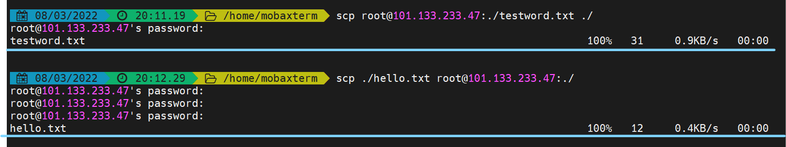
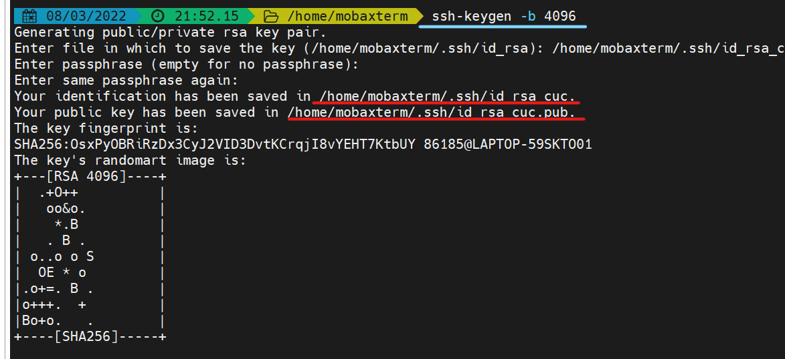

# 第一章 Linux实验

## 软件环境

本地虚拟机：Ubuntu 20.04.3 LTS

阿里云【云上实验平台】：CentOS Linux 7 (Core)

本机：Windows 11

## 实验问题

1. 调查并记录实验环境的如下信息：
   -  当前 Linux 发行版基本信息
   -  当前 Linux 内核版本信息

2. Virtualbox 安装完 Ubuntu 之后新添加的网卡如何实现系统开机自动启用和自动获取 IP？

3. 如何使用 `scp` 在「虚拟机和宿主机之间」、「本机和远程 Linux 系统之间」传输文件？
4. 如何配置 SSH 免密登录？

## 实验过程

### 调查并记录实验环境的信息

#### 本地虚拟机环境

- **Linux 发行版基本信息**
  查看发行版本信息有多种可选方式。利用`cat /etc/lsb-release`可以简要查看当前发行版本的版本名称、版本号等。
  
  利用`cat /etc/issue`能查看更简洁的发行版本信息
  
  或者利用`cat /etc/os-release`查看
  
  三种方式都显示本地虚拟机发行版是`Ubantu 20.04.3 LTS`
- **Linux 内核版本信息**
  查看当前Linux 内核的版本信息也有很多方式。例如使用`uname -r`和`cat /proc/version`都能够查看Linux的内核版本信息。
  
  当前linux内核版本是`5.4.0-100-generic`

#### 阿里云【零门槛云上实践平台】

- **Linux 发行版基本信息**
  同样地，查看云上实践平台的命令也有很多。利用`cat /etc/os-release`,`cat etc/system-release`,`cat /etc/centos-release`,`cat /etc/redhat-release`命令都能查看云上平台的发行版本信息。
  
  可知当前Linux发行版是`CentOS Linux release 7.7.1908 (Core)`
- **Linux 内核版本信息**
  利用`uname -r`指令可以查看云上平台Linux 内核的版本信息。
  
  当前Linux 系统内核版本是`3.10.0-1062.18.1.el7.x86_64`

### Virtualbox 安装完 Ubuntu 之后新添加的网卡如何实现系统开机自动启用和自动获取 IP？

1. 添加新网卡
   在关闭虚拟机后手动添加一块虚拟网卡。由于选择的是Host-Only连接方式，所以需要为该新网卡新增一个`Virtualbox Host-Only Ethernet Adapter`
   
2. 查看网卡状态
   使用`ip a`命令查看网卡状态，发现新装的网卡并不能自动获取IP。
   
<p align='center' style="color:grey;font-size:13px">对比enp0s8和enp0s9,enp0s9没有获取IP</p>

3. 修改文件配置`00-installer-config.yaml`
   仿照已有配置，加入新增网卡`esp0s9`的配置
   ```bash
   vim /etc/netplan/00-installer-config.yaml
   ```
   
   
4. 使配置生效，查看效果
   首先应用网络配置`sudo netplan apply`,然后重启`sudo reboot`，使用`ip a`查看IP分配情况。
   
   ip自动分配成功。测试可用性
   

### 如何使用 `scp` 在「虚拟机和宿主机之间」、「本机和远程 Linux 系统之间」传输文件？

#### 虚拟机和宿主机之间
1. **准备工作**
   - 在虚拟机上创建文件`test.txt`，并使用vim编辑其内容
     
   - 在宿主机上创建文件`hello.txt`，并将它移动到mobaXterm的家目录下
     
   - 测试网络是否通畅，`ping`宿主机
     
2. **使用`scp`传输**
   - 从虚拟机到宿主机：
     ```bash
     scp merumeru@192.168.56.103:~/test.txt ./
     ```
     
     
   - 从宿主机到虚拟机：
     ```bash
      scp ./hello.txt merumeru@192.168.56.103:~/
     ```
     
     

#### 本机和远程 Linux系统之间
操作基本与宿主机和虚拟机上一样。只不过需要注意地址的变化，以及每次传输文件时都需要输入密码。
```bash
 scp root@101.133.233.47:./testword.txt ./
 scp ./hello.txt root@101.133.233.47:./
```



### 如何配置 SSH 免密登录？

在进行到该问题前已经完成了SSH免密登录，并且已经在宿主机上完成一系列操作，所以此处不再重复配置常用实验平台的SSH免密登录，而是配置另一台虚拟机的免密登录。

1. 生成公私钥对
   利用`ssh-keygen -b 4096`指令生成4096位长的密钥，将其命名为id_rsa_cuc.(非常后悔的决定

  
2. 将公钥上传到虚拟机
   
   ```bash
   ssh-copy-id -i /home/mobaxterm/.ssh/id_rsa_cuc cuc@192.168.56.101
   ```
   
3. 尝试免密登录
   
   ```bash
   ssh -i /home/mobaxterm/.ssh/id_rsa_cuc cuc@192.168.56.101
   ```
   
   成功登录

p.s. mobaXterm自带保存密钥的功能，即使不配置ssh免密登录，输入一遍密钥后可以选择保存密钥。这样可以同样丝滑地实现免密登录的效果。

## 遇到的问题以及解决方法
遇到最大的问题在ssh免密登录这里。为了避免实验ssh免密登录虚拟机使用的公私钥对和常用实验平台重合，我在生成公私钥对的时候特地将它命名为`id_rsa_cuc`，这时候再用
```bash
ssh cuc@192.168.56.101
```
登录虚拟机，则完全无效，必须每次都输入密码。查阅资料，首先怀疑是用户登录权限不同。或许应该用root用户登录。于是有
```bash
ssh-copy-id -i /home/mobaxterm/.ssh/id_rsa_cuc  root@192.168.56.101
```
完全没有用。因为在输入密码的时候遇到了困难。所以我就怀疑是不是root用户不能直接登录进去。直接ssh登陆进虚拟机，查看`sshd_config`
```bash
sudo cat /etc/ssh/sshd_config
```
的确不能以root用户登录。但是我认为不能修改，虽然只是实验平台，但是还是有安全隐患。遂在搜索引擎上又好一顿搜索，终于发现：`sh默认使用的是id_rsa文件，因此直接执行ssh 用户@IP登录不成功，必须通过 -i 指定对应公钥的私钥文件登录方可`
遂输入
```bash
ssh -i /home/mobaxterm/.ssh/id_rsa_cuc cuc@192.168.56.101
```
成功登录。

> 补充说明：配置第三块网卡的目的在于复现第二块网卡的配置过程。实验开始之前，我的第二块网卡就能自动获取ip地址了

## 参考资料
- [markdown 官方教程](https://markdown.com.cn/)
- [许师哥的实验报告](https://github.com/CUCCS/2021-linux-public-EddieXu1125/blob/chap0x01/chap0x01/%E7%AC%AC%E4%B8%80%E6%AC%A1%E5%AE%9E%E9%AA%8C.md)
- [黄老师的往年视频](https://www.bilibili.com/video/BV1Hb4y1R7FE?p=23)
- [SSH免密登录设置后不起作用](https://blog.csdn.net/zcs20082015/article/details/81018555)
- [Linux内核版本介绍与查询](https://www.cnblogs.com/still-smile/p/11597620.html)
- [Linux vim 三种工作模式详解](http://c.biancheng.net/view/804.html)