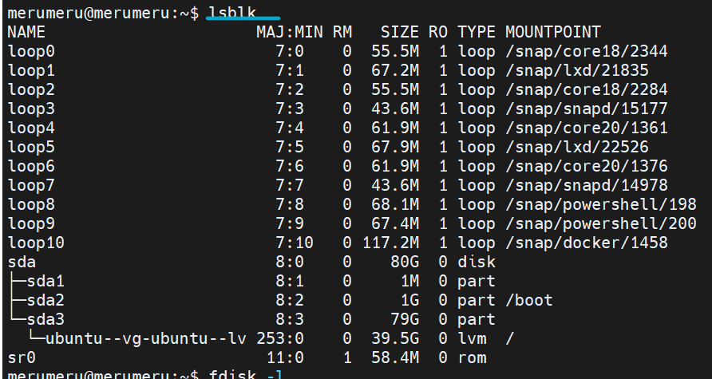
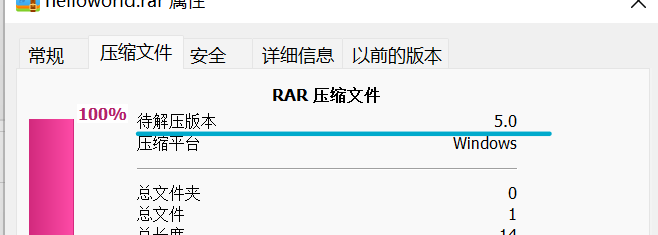

# 第二章 Linux实验


## 软件环境

本地虚拟机：Ubuntu 20.04

阿里云【云上实验平台】：CentOS Linux release 7.7.1908 (Core)

本机：windows 11


## 实验问题

- 【软件包管理】在目标发行版上安装 `tmux` 和 `tshark` ；查看这 2 个软件被安装到哪些路径；卸载 `tshark`；验证 `tshark` 卸载结果

- 【文件管理】复制以下`shell`代码到终端运行，在目标 Linux 发行版系统中构造测试数据集，然后回答以下问题：

  - 找到 `/tmp` 目录及其所有子目录下，文件名包含 `666` 的所有文件
  - 找到 `/tmp` 目录及其所有子目录下，文件内容包含 `666` 的所有文件

  ```shell
  cd /tmp && for i in $(seq 0 1024);do dir="test-$RANDOM";mkdir "$dir";echo "$RANDOM" > "$dir/$dir-$RANDOM";done
  ```

- 【文件压缩与解压缩】练习课件中 [文件压缩与解压缩](https://c4pr1c3.github.io/LinuxSysAdmin/chap0x02.md.html#/12/1) 一节所有提到的压缩与解压缩命令的使用方法

- 【跟练】 [子进程管理实验](https://asciinema.org/a/f3ux5ogwbxwo2q0wxxd0hmn54)

- 【硬件信息获取】目标系统的 CPU、内存大小、硬盘数量与硬盘容量


## 实验过程

### 软件包管理

|              | Ubuntu 20.04                   | CentOS Linux release 7.7.1908 (Core)                         |
| ------------ | ------------------------------ | ------------------------------------------------------------ |
| 安装tmux     | `apt install tmux`             | `sudo yum install tmux`                                      |
| 安装tshark   | `apt install tshark`           | `yum whatprovides tshark`<br>`yum install wireshark`         |
| 查看安装路径 | `dpkg -L tmux`或`tshark`       | `rpm -qal \|grep tmux`或`tshark` <br> `which tmux `或` tshark`<br>`find / -name tmux` 或`tshark` |
| 卸载         | `apt remove tmux/tshark`       | `sudo yum remove tmux` 或 `tshark`                           |
| 验证卸载结果 | `apt-cache policy tmux/tshark` | `rpm -qal \|grep tmux`或`tshark` ，若没有路径说明已经卸载    |

- ubuntu 20.04

  [](https://asciinema.org/a/WPkKaxzReFXQgIbhfhfJrYyPf)

- CentOS Linux release 7.7.1908 (Core)

  [](https://asciinema.org/a/QniZarnVtWF3QwT9JH4m3DcUd)

### 文件管理

|                                      | 找到 `/tmp` 目录及其所有子目录下，文件名包含 `666` 的所有文件 | 找到 `/tmp` 目录及其所有子目录下，文件内容包含 `666` 的所有文件 |
| ------------------------------------ | ------------------------------------------------------------ | ------------------------------------------------------------ |
| ubuntu 20.04                         | `sudo find /tmp -name 'test*666*' `<br> `sudo find /tmp -name 'test*'\|grep "666" `<br> `find test*\|grep 666` | `sudo grep --recursive '666' /tmp`<br>` sudo find test*\|xargs grep -r "666"` |
| CentOS Linux release 7.7.1908 (Core) | `find -name '*666*'`<br>`find -name 'test*' \| grep 666' `<br>`find test*\| grep 666` | `grep --recursive '666' /tmp`<br>`find test*\| xargs grep -r "666"` |


- ubuntu 20.07

  [](https://asciinema.org/a/VqGqmciPNpNWLZNcbRfhZpBZe)

- CentOS Linux release 7.7.1908 (Core)

  [](https://asciinema.org/a/p7WOGVjRi0pFweSo5L13pLAFC)

### 文件压缩与解压缩

|       | ubuntu 20.04                                                 | CentOS Linux release 7.7.1908 (Core)                         |
| ----- | ------------------------------------------------------------ | ------------------------------------------------------------ |
| gzip  | 压缩：`gzip test.txt` <br>解压缩：`gzip -d test.txt.gz` <br>压缩文件并查看压缩率：`gzip -v test.txt` | 压缩：`gzip test1.txt test2.txt`（一次压缩两个文件）<br>压缩文件夹内的文件：`gzip -r tests`（tests是文件夹名）<br>解压缩：`gzip -d test1.txt.gz test2.txt.gz`(一次解压两个文件)<br>解压缩文件夹内的文件：`gzip -d -r tests` |
| bzip2 | 压缩：`bzip2 test.txt` <br>解压缩：`bzip2 -d test.txt.bz2`<br>解压缩并输出到标准输出：`bzip2 -dc test.txt.bz2` | 压缩：`bzip2 test2.txt`<br>解压文件输出到标准输出：`bzcat test2.txt.bz2`<br>解压缩：`bunzip2 test2.txt.bz2` |
| zip   | 压缩：`zip test.zip test.txt`<br>解压：`unzip test.zip`      | 压缩：`zip testhello.zip test1.txt  test2.txt`<br>在压缩包里删除条目：`zip -d testhello.zip test2.txt`<br>解压缩：`unzip testhello.zip` |
| tar   | 压缩：`tar cf hello.tar hello.txt test.txt`<br>列出压缩包的内容：`tar tvf hello.tar`<br>向已有压缩包中添加文件：`tar -rvf  hello.tar hello.html`<br>仅解压拓展名位txt的文件：`tar xf hello.tar --wildcards "*.txt"        `<br>将解压出的文件放到目录中：`tar xf hello.tar --directory=txtsdir/     ` | 压缩：`tar czf hellotest.tar.gz test1.txt test2.txt`<br>查看压缩包内文件条目：`tar tvf hellotest.tar.gz`<br>解压缩:`tar xvf hellotest.tar.gz` |
| 7z    | 压缩：`p7zip hello.txt`<br>压缩并保留原文件：`p7zip -k hello.html`<br>解压缩并将内容解压到标准输出：`p7zip -d -c hello.txt.7z`  <br>解压缩：`p7zip -d hello.html.7z` | 压缩:`7za a test2.7z test2.txt`<br>解压缩：`7za x test2.7z`  |
| rar   | 解压缩：`rar x helloworld.rar`<br>将文件内容放到标准输出：`rar p helloworld.rar` | 解压缩:`rar x helloworld.rar`                                |

- gzip 操作录屏 ubuntu 20.04 

  [](https://asciinema.org/a/DM4EFUtDnx3f51pSbP9pXEbaK)

- bzip2操作录屏 ubuntu 20.04

  [](https://asciinema.org/a/P65TpMxYSH8rHHUiTTdAcUzWS)

- zip操作录屏 ubuntu20.04

  [](https://asciinema.org/a/vmJjYRx5NTaH4Q44wq6YN84X2)

- tar操作录屏 ubuntu 20.04

  [](https://asciinema.org/a/2DS8YijqLMFbUfvfkqO3ULeUx)

- p7zip操作录屏 ubuntu 20.04

  [](https://asciinema.org/a/BHrXBWg6ySkE1TKG6UA57CG9w)

- rar操作 ubuntu 20.04(使用的unrar-free,只能解压使用rar2.0压缩的文件，而宿主机使用rar5.0，所以无法解压缩)

  [](https://asciinema.org/a/3EUPCgAyZSdr5JxvKTaCfg5KV)

- rar操作录屏 ubuntu 20.04(使用的rar，可以解压缩)

  [](https://asciinema.org/a/eXCN5A9uZmG7oDvoGsSlVKro9)

- gzip,bzip2,zip,tar操作录屏 CentOS Linux release 7.7.1908 (Core) (这次没有录p7zip和rar操作是因为录的时候没做好p7zip使用的功课，既无法通过man手册页获得p7zip的使用方法，也无法查到p7zip是否安装成功)

  [](https://asciinema.org/a/CGpT0m9A3NvxYeVwpKgnEgKn7)

- p7zip和rar操作录屏 CentOS Linux release 7.7.1908 (Core)

  [](https://asciinema.org/a/J9qvqfbQfi8wNL2L3wMoJbXVb)

  **p.s.**  **merumeru**是**我本地虚拟机**的名字，在本地做实验的时候**不会**出现第二个用户名，也不会去用别人的虚拟机（除非特别标注）。root是阿里云平台的机器，@符号后面的标识在变是因为我为了做实验换了好几台云端虚拟机，不为别的，主要是一台机器只能使用一个小时，所以需要频繁的更换机器以完成实验。

### 子进程管理实验

| 主要使用指令                          | 意义                                                         |
| ------------------------------------- | ------------------------------------------------------------ |
| `ping`                                | ping 域名                                                    |
| `ps aux \| grep ping`                 | 查看进程的ID                                                 |
| `ping 域名 &`                         | &表示后台执行                                                |
| `ping 域名 1>/dev/null 2>&1`          | 表示ping的输出都送到/dev/null目录下，也就是丢掉输出          |
| `fg`                                  | 把后台进程提到前台                                           |
| `kill ID/killall 进程名称/kill -9 ID` | 结束ID为*ID*的进程/结束所有名字为*name*的进程/强制结束ID为*ID*的进程 |

- ubuntu 20.04操作录屏

  [](https://asciinema.org/a/gphEtOy36xqAj741XhQtQrN6H)

- CentOS操作录屏

  [](https://asciinema.org/a/Pdri7oZaZTxII6XgZs2F7HG9d)


### 硬件信息获取

|           | ubuntu 20.04                                           | CentOS Linux release 7.7.1908 (Core) |
| --------- | ------------------------------------------------------ | ------------------------------------ |
| CPU的信息 | `report-hw \|grep cp`                                  | `lscpu`                              |
| 内存大小  | `report-hw \|grep mem`                                 | `lsmem`                              |
| 硬盘数量  | `report-hw \| grep df`<br>`sudo fdisk -l`<br> `lsdsk`  | `lsblk`<br>`fdisk -l`                |
| 硬盘容量  | `report-hw \|grep df`<br/>`sudo fdisk -l`<br/> `lsdsk` | `lsblk`<br>`fdisk -l`                |

- 查看ubuntu 20.04硬件信息

  [](https://asciinema.org/a/WICrMm1sjoTP1eRU9aCpqhvrf)

  撰写报告的时候突然意识到查看硬盘的数量及容量的方法还有很多，遂补充：

  

  *用fdisk -l 查看硬盘数量及分区*

  

- 查看CentOS Linux release 7.7.1908 (Core) 硬件信息

  [](https://asciinema.org/a/nXyettghANQFHAbJ8Zmt9IkJr)


### 问题及解决方法

1. 在CentOS平台上无法直接用yum下载tshark，因为找不到。后来查询到，tshark被wireshark提供，所以如果想下载tshark，可以直接下载wireshark。下载安装完成后，可以利用tshark -v查询是否安装成功。如果正确显示版本信息则安装成功。

2. unrar-free无法解压缩宿主机压缩的rar文件。报错如下：

   

   而待解压文件（由宿主机传输给虚拟机）

   

   对于unrar-free来说，宿主机上的rar版本还是太高了。于是有两个解决路径：要么安装低版本rar压缩,要么安装高版本rar解压缩。虽然linux的rar是私有算法格式，但我打算试一试。安装rar后，可以正常解压。具体过程已经在录屏中展示过了。

3. p7zip安装后使用不了。在CentOS Linux上面可以正常安装p7zip，问题在于它无法像ubuntu一样直接使用p7zip +到文件的路径压缩和p7zip -d +文件解压缩。安装过后如果直接使用p7zip命令会出现command not found的报错。后来参考同学的意见，使用7za a/7za d进行压缩和解压缩，可以使用。具体过程在录屏里也有体现（甚至把出错的全过程都录上了……）

4. rar无法直接通过yum安装。查询后得知安装rar需要自行下载其安装包。网上的教程提供的下载地址和我自己找到的较为可信的地址不一样，所以地址做了修改。

   利用`wget https://www.win-rar.com/fileadmin/winrar-versions/rarlinux-x64-611.tar.gz`下载安装包，解压后进入`rar`文件夹，`make`进行配置。随后即可使用。


### 参考资料

- [CentOS 7 安装rar解压rar ](https://www.jianshu.com/p/8199d21f74fe)
- [CentOS安装tshark](https://blog.csdn.net/xzm5708796/article/details/86487555)
- [nohup /dev/null 2>&1 含义详解](https://blog.csdn.net/u010889390/article/details/50575345)
- [Linux lsblk 命令用法详解 (ipcmen.com)](https://ipcmen.com/lsblk)
- [centos Linux 查看硬盘常用命令](https://www.cnblogs.com/acck/p/9540693.html)
- [CentOS下查看cpu，内存，硬盘等硬件信息的方法CentOS中文站 ](https://www.centoschina.cn/course/introduction/9527.html)

