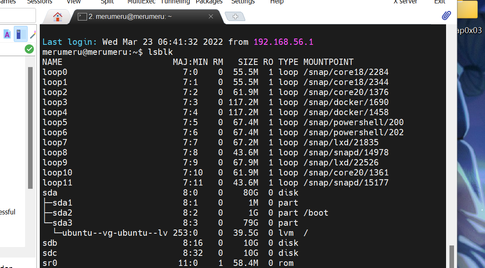
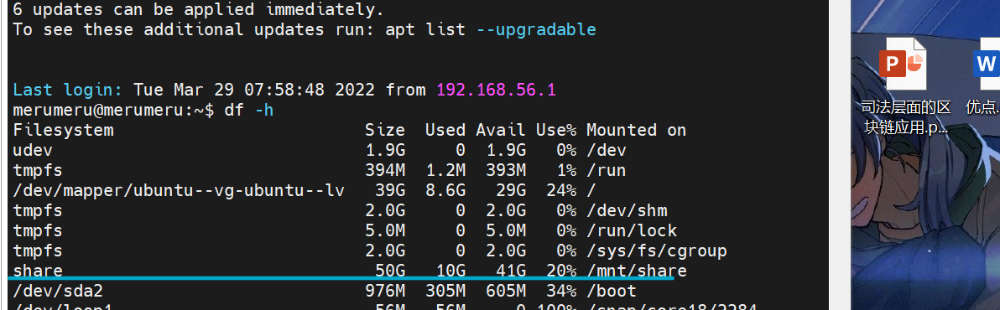

# 第三章 Linux服务器系统管理基础


## 实验环境

宿主机：windows 11

本地虚拟机：ubuntu 20.04


## 实验问题

1. 依据[Systemd 入门教程：命令篇 ]([Systemd 入门教程：命令篇 - 阮一峰的网络日志 (ruanyifeng.com)](http://www.ruanyifeng.com/blog/2016/03/systemd-tutorial-commands.html))完成基本操作
2. 依据[Systemd 入门教程：实战篇 ](http://www.ruanyifeng.com/blog/2016/03/systemd-tutorial-part-two.html)完成基本操作
3. 本章结束后的自查清单


## 实验过程

#### 依据Systemd 入门教程：命令篇完成基本操作

1. 查看`systemd`的版本

   [](https://asciinema.org/a/2ihb0usCNfPvPccpZpjIxVUqw)

2. 系统管理

   [](https://asciinema.org/a/TTHwigc9mp2uRCXM9nF38noA9)

3. Unit

   [](https://asciinema.org/a/VroTGr0ghBs8EdErGZJvZqKQN)

4. Unit配置文件

   [](https://asciinema.org/a/1xVsxSzbuWO0iZy4BPNUWmXkc)

5. Target

   [](https://asciinema.org/a/dkA7wuvEOkH7a5rYJso26TntW)

6. 日志管理

   [](https://asciinema.org/a/dj7t7AAFcQIRtrj4vNJI1bRo1)

#### 依据Systemd 入门教程：实战篇完成基本操作

该部分充分体现在自查清单的实现:"如何通过`systemd`设置实现在网络连通时运行一个指定脚本，在网络断开时运行另一脚本"里。

#### 本章结束后的自查清单

- 如何添加一个用户并使其具备sudo执行程序的权限？

  执行`sudo adduser test` 添加用户

  

  用`sudo visudo`编辑`/etc/sudoer`文件，在`# Allow members of group sudo to execute any command`下为用户`test`提权，`%test   ALL=(ALL:ALL) ALL`。随后检查一下test用户是否拥有sudo权限。`sudo -l -U test`。

  

- 如何将一个用户添加到一个用户组？

  比如说，我把`test用户`添加到我的`merumeru用户组`里面。

  ```bash
  sudo usermod --append --groups 1000 test
  ```

  

- 如何查看当前系统的分区表和文件系统详细信息？

  ```bash
  lsblk
  df -h #两个指令均可
  ```

  

- 如何实现开机自动挂载Virtualbox的共享目录分区？

  - 关闭虚拟机，创建共享目录,不需要自动分配。

    

  - 在`/mnt`下创建挂载点`share`,`cd /mnt && sudo mkdir share`

  - 在`/etc/systemd/system`下创建一个`mount`文件，文件名称为`mnt-share.mount`

    

  - 修改`mount`文件，如下

    ```bash
    [Unit]
    Description = Auto mount vboxsf share #描述只要写的清晰明了即可
    DefaultDependencies = no
    ConditionPathExists = /mnt/share #检查路径是否存在。只可以使用绝对路径
    Before = sysinit.target #在系统初始化之前启动
    
    [Mount]
    What = share
    where = /mnt/share
    Type = vboxsf #对照fstab中对virtualbox共享目录分区类型的描述，以及网上的教程，此处我推测应当如此（可以成功挂载，应当证明了此处正确）
    
    [Install]
    WantedBy = multi-user.target
    ```

  - 随后执行`systemctl enable mnt-share.mount`，使之生效。

  - 重启，查看是否自动挂载

    

    

    

- 基于LVM（逻辑分卷管理）的分区如何实现动态扩容和缩减容量？

  **缩减容量**：

  ```bash
  #demo-vg是卷组名，缩减的逻辑分区是demo-lv-2
  lvresize --size -4G --resizefs demo-vg/demo-lv-2 
  ```

  

  **增加容量：**

  ```bash
  lvresize --size +4G --resizefs demo-vg/demo-lv-2 
  #或者直接增加所有剩余空间
  lvresize --extents +100%FREE demo-vg/demo-lv-2
  ```

  

  

- 如何通过`systemd`设置实现在网络连通时运行一个指定脚本，在网络断开时运行另一脚本？

  **通过创建service Unit 的方式。**

  - 在`/etc/systemd/system`目录里创建`start-when-network-available.service`

  - ```bash
    [Unit]
    Description=a test service which should be started when network is available
    Requires=systemd-networkd.service
    After=network.target
    [Service]
    ExecStart=/bin/bash /home/merumeru/start-when-networka.sh
    ExecStopPost=/bin/bash /home/merumeru/start-when-networku.sh
    RemainAfterExit=yes
    Type=oneshot
    Restart=on-abnormal
    
    [Install]
    WantedBy=multi-user.target
    ```

  - 如上编辑这个文件,网络连通时执行`start-when-networka.sh`，断开时执行`start-when-networku.sh`，脚本内容如下

    ```bash
    #start-when-networka.sh
    #!/bin/bash
    echo "script which start when network is available" >> /home/merumeru/output.txt
    
    #start-when-networku.sh
    #!/bin/bash
    echo "script which starts when network unavailable" >> /home/merumeru/output.txt
    ```

  - 通过停止`systemd-networkd.service`断开网络，查看脚本执行情况。因为网络断开，所以无法远程登陆虚拟机，只能在虚拟机窗口查看。

    

- 如何通过`systemd`设置实现一个脚本在任何情况下被杀死之后会立即重新启动？实现***杀不死\***？

  ```bash
  [Service]
  Restart=always
  ```


## 问题以及解决方法

1. `开机自动挂载virtualbox共享目录分区`。起初尝试修改`/etc/fstab`以达到`开机自动挂载virtualbox共享目录分区`的目的，然而修改后发现并不能自动挂载。后来自查发现原因是`defaults`参数敲成`default`上课求助老师后，转而尝试利用`systemd`完成`开机自动挂载virtualbox共享目录分区`。

   既然需要`开机自动挂载`，我的第一反应就是`touch xxxx.automount`并进行配置。然出现如下报错。

   

   遂明白automount并不是所需的`开机自动挂载`，因为无法指定`what`：什么设备，`Type`：什么文件系统类型。转而诉诸`mount`.

2. 基于LVM的动态扩容。指定空间大小扩容的方法没有问题，问题出在使用`百分比`扩容，例如将剩余的全部可用空间分配给指定lv。`tldr`中使用百分比扩容的语法是：

   ```bash
   #Extend the size of a logical volume to 100% of the free physical volume space:
   lvresize --size {{100}}%FREE {{volume_group}}/{{logical_volume}}
   
   ```

   

   然而如果使用会出现如下报错：

   

   **而事实上`man`手册页中关于`100%FREE`这种参数的使用方法是：**

   

   震惊地发现`tldr手册出错了`。所以如果想要利用余下所有的剩余空间应该使用命令：

   ```bash
   lvresize --extents +100%FREE demo-vg/demo-lv-2
   ```

3. 如何通过`systemd`设置实现在网络连通时运行一个指定脚本，在网络断开时运行另一脚本？

   初始解题思路有二：`其一`，大胆地修改`systemd-networkd.service`，让它运行开始时执行一个脚本，运行停止后执行一个脚本。`其二`，谨慎地创建一个`service`Unit,让它在网络运行时执行一个脚本，在网络断开时停止服务，执行另一个脚本。

   第一个思路以失败告终，主要是因为胆子还是不够大。

   

   `Type=notify`的`service`不允许多个`ExecStart`，也就无法完成网络连通执行一个脚本，因为这个位置被其它活动占去了。尚未尝试修改使`Type=oneshot`，主要是怕影响其它系统进程。

   `实验过程`中的解题思路是思路二。

## 参考资料

- [Linux中sudo、su和su -命令的区别小结](https://cloud.tencent.com/developer/article/1721753)
- [systemd 自动挂载磁盘](https://blog.csdn.net/weixin_34211761/article/details/91708618)
- [Linux中使用systemd挂载文件系统](https://blog.csdn.net/wangmj518/article/details/42217689)
- [systemd.unit 中文手册 ](http://www.jinbuguo.com/systemd/systemd.unit.html)
- [启动流程、模块管理、BootLoader(Grub2)](https://www.jianshu.com/p/7276a98e74cf)
- [linux输入输出管理、输入/出重定向、追加输出（不覆盖原文件](https://blog.csdn.net/m0_55005311/article/details/115409217)
- [Systemd 入门教程：实战篇 - 阮一峰的网络日志 (ruanyifeng.com)](http://www.ruanyifeng.com/blog/2016/03/systemd-tutorial-part-two.html)
- [Systemd 入门教程：命令篇 - 阮一峰的网络日志 (ruanyifeng.com)](http://www.ruanyifeng.com/blog/2016/03/systemd-tutorial-commands.html)

