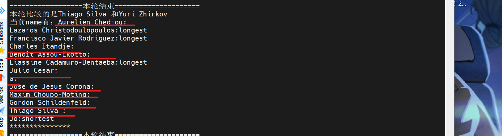
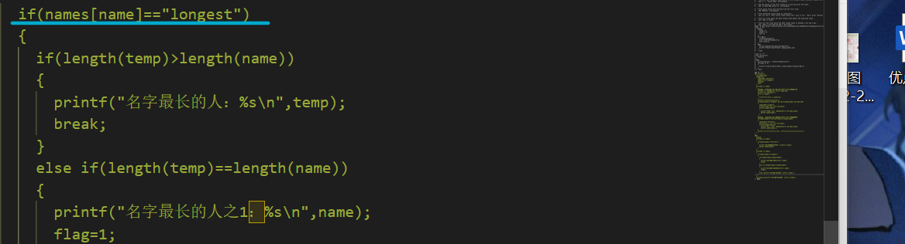
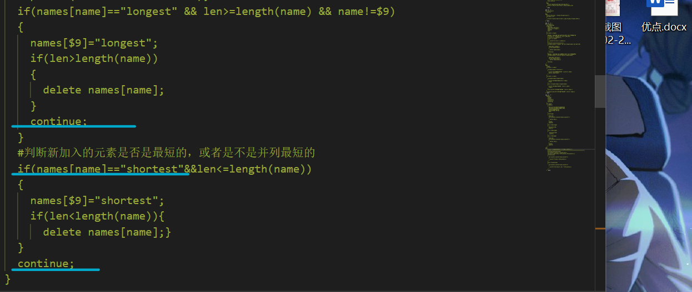
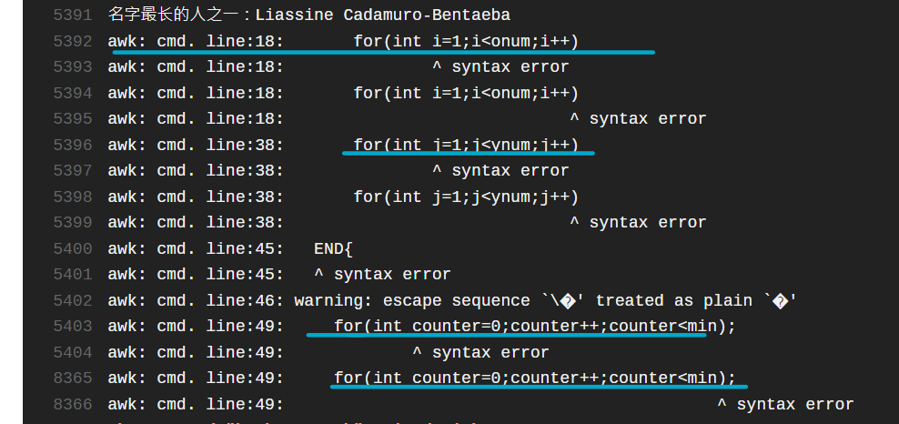

# 第四章：shell脚本编程基础

### 实验环境

宿主机：window11

虚拟机：Ubuntu 20.04


### 实验问题

- 任务一：用bash编写一个图片批处理脚本，实现以下功能：

  - [x] 支持命令行参数方式使用不同功能
  - [x] 支持对指定目录下所有支持格式的图片文件进行批处理
  - [x] 支持以下常见图片批处理功能的单独使用或组合使用
    - [x] 支持对jpeg格式图片进行图片质量压缩
    - [x] 支持对jpeg/png/svg格式图片在保持原始宽高比的前提下压缩分辨率
    - [x] 支持对图片批量添加自定义文本水印
    - [x] 支持批量重命名（统一添加文件名前缀或后缀，不影响原始文件扩展名）
    - [x] 支持将png/svg图片统一转换为jpg格式图片

  

- 任务二：用bash编写一个文本批处理脚本，对以下附件分别进行批量处理完成相应的数据统计任务：

  - 2014世界杯运动员数据
    - [x] 统计不同年龄区间范围（20岁以下、[20-30]、30岁以上）的球员**数量**、**百分比**
    - [x] 统计不同场上位置的球员**数量**、**百分比**
    - [x] 名字最长的球员是谁？名字最短的球员是谁？
    - [x] 年龄最大的球员是谁？年龄最小的球员是谁
  - Web服务器访问日志
    - [x] 统计访问来源主机TOP 100和分别对应出现的总次数
    - [x] 统计访问来源主机TOP 100 IP和分别对应出现的总次数
    - [x] 统计最频繁被访问的URL TOP 100
    - [x] 统计不同响应状态码的出现次数和对应百分比
    - [x] 分别统计不同4XX状态码对应的TOP 10 URL和对应出现的总次数
    - [x] 给定URL输出TOP 100访问来源主机

### 实验过程

##### 任务一

解题思路：

- 首先考虑三个框架性的要求。

  - 如果要支持命令行参数使用不同的功能，就要考虑给脚本传参。
  - 如果要支持对指定目录下所有支持格式的图片进行批处理，就确定了传入的参数是目标目录。
  - 如果要支持对各种功能的组合使用，那么就要考虑传入多参数的情况，并且能够对参数和值进行区分，而且每一个参数都可以生效。

  这就为参数的使用画好了边界。可以考虑遍历参数数组取出一个一个参数，然后利用case选择函数执行。be like:

  ```bash
  for i in "$@"
  do
     case $i in
     a)... shift;
     b)... shift;
     ...
  done
  ```

  但是后来发现比较麻烦，需要传值的和不需要传值的选项需要的shift数目是不同的，不太优雅。所以听取老师和师姐的意见，改成比较现代化的`getopts`

  ```bash
  while getopts 'abcd:e...' operation; do
    case $operation in
    a) ... ;;
    d) ..."$OPTARG"... ;;
    \?) ... ;;
  ```

  简单明了。

- 现在关注五个细节需求，这意味着五个函数，但是重命名我把它拆了一下，加上帮助函数，总共七个。除了帮助函数，每一个函数都需要指明对象所在文件夹，所以干脆把地址单独赋值给一个变量。

  - 压缩jpeg图像部分考虑了bzip2和打包压缩tar的方法，为了方便测试，添加了一个解压缩的方法。所以总共是三个有关压缩的函数。需要注意的是，因为函数只针对jpeg文件，所以需要加限制条件。考虑直接用find方法，将其输出通过管道操作符给压缩命令。

  - 第二个函数是缩放。查找各种资料后决定利用imagemagick包里的mogrify，它不保留原图片，这也比较符合我的理解（我的理解是直接操作图片）

  - 水印部分同样使用mogrify,直接往图片上写字

  - 重命名分成前缀和后缀，因为这样在命令行参数部分比较好实现。加前缀就遍历文件夹中所有文件，mv原文件到新文件，新文件用重组的新文件名。be like:

    ```bash
    for file in *; do
        mv -f "$file" "$2_$file"#$2是文件前缀
        done
    ```

    后缀稍微复杂一点。考虑把文件名和后缀拆开，文件名后缀加入名字后面再重新组合。组合过程用到了正则表达式。

    ```bash
    for file in *; do
            origin_name=${file%.*}
            extension=${file##*.}
            mv -f "$file" "${origin_name}_$2.${extension}"
    done
    ```

  - 改变文件后缀的思路跟添加后缀很相似，分割名称，判断后缀，改变后缀再重新组合。

    ```bash
    origin_name=${file%.*}
    extension=${file##*.}
    if [[ ${extension} == "png"||${extension} == "svg" ]]; then
    convert "$file" "${origin_name}.jpg"
    ```

##### 任务二

- Part1

  - 这一部分基本都在用`awk脚本`。第一个问题，只需要设置三个变量，分别代表`20以下`，`[20-30]`，`30以上`的人数，在`awk`处理整个`tsv文本`的过程中，利用条件判断对着三个变量进行累加，最后输出即可。

    ```bash
     $6!="Age"{
        if($6<20){young+=1}
        else if($6<=30){middle+=1}
        else {old+=1}
      }
    ```

  - 求不同位置球员数量和百分比。为了使这一部分尽量简单，我省去了记人数的变量，处理过程只有向以位置为索引的数组里加人的一句话，结尾部分只要遍历数组输出就可以，百分比可以用数组`position[i]`的值比上`NR`，在`printf`函数后半部分计算。

    ```bash
    $5!="Position"{
      P[$5]+=1
    }
    END{
      printf("Position  \tTotal\tProportion\n")
      for(name in P)
      {
        printf("%-10s\t%-5d\t%-10f\n",name,P[name],P[name]/(NR-1))
      }
    }' data
    ```

    

  - 考虑名字最长的球员和最短的球员的时候需要注意字符编码，因为要考虑的是字节最长而不是看起来最长。所以首先要确定该`tsv文件`的编码方式。

    ```bash
    file worldcupplayerinfo.tsv
    ```

    

    `utf-8`同样也是`ubuntu`默认编码方式，且支持多种语言，所以就用默认好了。

    在考虑怎样实现复杂度最低的方法时，我总共产生了两种思路：

    - 两个索引数组，一个存储最长名字，一个存储最短名字，到最后遍历两个数组即可。向数组中存储名字时，只需要比较最后一个元素。存储最长名字时，如果当前元素`长于`数组中最后一个元素，就删掉数组中所有元素，存储当前元素；如果`等于`，就数组就增加一个元素，如果`小于`就比较它是否是最小的，这与最大数组同理。
    - 一个索引数组，存放所有需要输出的名字。名字作为索引，存储的值是`shortest`或`longest`。脚本执行时遍历数组中每一个元素，首先判断它的值，如果是`longest`就比较新加入的`名字`是否长度大于等于遍历此刻遍历到的元素的`索引`，如果是就在数组里添加以新加入`名字`作为`索引`、值为`longest`的元素，如果上述比较仅仅满足`大于`，就删掉遍历到的元素。进行完上述操作后直接`continue`到下一轮。`shortest`情况同理。在输出的时候，率先打印`名字最短的人`，打印一个元素删一个元素，在遍历最长的名字的时候就可以直接遍历了。

    代码使用的是第二个思路，因为我想省点空间。但后来一想两种都是在动态的删除、新增，而且数组中元素的个数都是一样的，所以没必要……

    不过确实锻炼了调试能力（哭。

    ```bash
     for(name in names)
      {
        if(names[name]=="longest" && len>=length(name) && name!=$9)
        {
          names[$9]="longest";
          if(len>length(name))
          {
            delete names[name];
          }
          continue;
        }
        #下方省略判断新加入的元素是否是最短的，或者是不是并列最短的
        ......
      }
    ===============================================================
    #这是核心思想的代码
    END{
      flag=0
      for(name in names)
      {
        if(names[name]=="shortest")
        {
          printf("名字最短的人（之一）：%s\n",name);
          delete names[name];
        }
      }
      for(name in names)
      {
       printf("名字最长的人之一：%s\n",name);
    }' data
    ```

    

  - 寻找年龄最大的球员和年龄最小的球员。使用了类似于上一问第一个思路的解题方式。区别在于不存储年龄，只存储姓名。所以数组的索引是`数字`，所以需要两个变量存储数组`最后一位`的位置。因为不在数组中存储年龄，又需要做年龄的比较，所以需要两个变量存储当前`最大年龄` 和`当前最小年龄`。最后输出环节需要一个`counter`，总共需要提前声明`5`个变量。为了减少输出的复杂度，两个数组`同时输出`，最短数组输出结束后，较长数组继续输出。

    ```bash
    #只是核心思想的代码
    if($6>oage)
        {
          OP[0]=$9;
          for(icounter;icounter<onum;icounter++)
          {
            delete OP[i];
          }
          onum=0;
          oage=$6;
        }
        else if($6==oage)
        {
          OP[onum+1]=$9;
          onum+=1;
        }
        else if($6==yage)
        {
           YP[ynum+1]=$9;
           ynum+=1;
        }
        else if($6<yage)
        {
          YP[0]=$9;
          for(jcounter;jcounter<ynum;jcounter++)
          {
            delete YP[j];
          }
          ynum=0;
          yage=$6;
        }
    ```

    

- Part2

  这部分继续用数组来计算会很麻烦。但是用`awk`配合其它命令会很方便。

  - `uniq -c` 可以去重并且在左侧计数。所以在统计`来源主机top100`时，只需要利用`awk`把主机名称取出通过管道操作符送到`uniq -c`去重，结果用`sort`按第一个输入排序最后输出前`100`就可以了。

    ```bash
    awk -F '\t' '{print $1}' web_log.tsv | sort | uniq -c | sort -r -n -k1 | head -100
    ```

    

    需要注意`uniq`对离得远的记录没有去重功能，所以需要先`sort`一下

  - 第二问只需要用正则表达式过滤出IP地址，然后跟上题基本一样。

  - 第三问把`$1`换成`$5`即可，就是把主机换成URL。

  - 统计不同状态码出现次数和百分比，相比起上述三问只多了计算过程。同样，把状态码取出之后送去去重，结果当作一个**新文件**输入`awk`进行处理，用一个数组存放状态码和对应的次数，另一个数组存放状态码和对应的占比，占比计算所用的总数通过`total+=$1`解决。`$1`对应的是状态码出现的次数。处理的最后计算百分比，输出。

  - 分别统计不同`4XX`状态码对应的`TOP 10 URL`和对应出现的总次数。从上一题的输出可以知道，文件中总共只有`404` `403`两种`4XX`状态码，所以两种分别处理即可。剩余排序的道理跟第一题很像

  - 给定URL输出TOP 100访问来源主机。这个需要一个参数输入。需要在`awk`里用`-v`生成定义一个变量`url`，赋给函数传进来的值，方便在`awk`脚本里使用。只要`$5==url`,就把主机名送给后面的管道操作处理。跟第一问很像。


### 问题和解决方法

1. 删不掉的数组元素

   

   因为发现输出的名字太多了，而且明显一些名字比其他名字短，于是我在代码中写了很多打印信息打印出来看看。发现很多本应该删掉的元素以空值的方式，保留着索引，留在我的数组里。

   本来我用了一种及其粗暴的方式阻绝了过多输出：

   

   但是我认为删不掉元素非常不对劲。为什么只有值是`longest`的元素删不掉而`shortest`的可以能？

   仔细查了一下资料，看了一下代码，发现：

   

   原本上图的`continue`都是没有的。也就是说，元素删除了之后，我又在下面的判断句里面重新生成了这个元素，值为空值。加上`continue`就运行正常了。

2. `syntax error`

   

   在`awk`中，不支持在循环判断句中声明变量


### 参考资料

- [shell获取参数的方法](https://www.cnblogs.com/zk47/p/3918086.html)
- [shell多个文件重命名与移动](https://geek-docs.com/shell/shell-examples/rename-and-move-multiple-shell-files.html)
- [shell遍历数组的两种方式](https://blog.csdn.net/puqutogether/article/details/45872241)
- [shell数组详解](https://www.cnblogs.com/liujunjun/p/12398078.html)
- [awk命令详解](https://itpcb.com/linux/c/awk.html)
- [uniq命令](https://www.cnblogs.com/delav/p/9953330.html)
- [imagemagick详解]([ImageMagick 教程_w3cschool](https://www.w3cschool.cn/imagemagick_use/))

