# 第五章：Web服务器

### 实验环境

客机：ubuntu20.04

主机：windows 11

软件环境：

- nginx
- verynginx
- WordPress 4.7
- DVWA

### 实验要求

##### 基本要求

- [x] 在一台主机（虚拟机）上同时配置*Nginx*和*VeryNginx*
  - [x] *VeryNginx*作为本次实验的`Web App的反向代理服务器`和`WAF`
  - [x] `PHP-FPM`进程的反向代理配置在*nginx*服务器上，*VeryNginx*服务器不直接配置Web站点服务

- [x] 使用*Wordpress*搭建的站点对外提供访问的地址为： `http://wp.sec.cuc.edu.cn`

- [x] 使用*Damn Vulnerable Web Application (DVWA)*搭建的站点对外提供访问的地址为：` http://dvwa.sec.cuc.edu.cn`

##### 安全加固要求

- [x] 使用IP地址方式均无法访问上述任意站点，并向访客展示自定义的**友好错误提示信息页面-1**

- [x] *Damn Vulnerable Web Application (DVWA)]*只允许白名单上的访客来源IP，其他来源的IP访问均向访客展示自定义的**友好错误提示信息页面-2**

- [x] 在不升级*Wordpress*版本的情况下，通过定制*VeryNginx*的访问控制策略规则，**热**修复`WordPress < 4.7.1 - Username Enumeration`

- [x] 通过配置*VeryNginx*的Filter规则实现对*Damn Vulnerable Web Application (DVWA)*的`SQL注入实验`在`低安全等级`条件下进行防护

##### VeryNginx配置要求

- [x] *VeryNginx*的Web管理页面仅允许白名单上的访客来源IP，其他来源的IP访问均向访客展示自定义的**友好错误提示信息页面-3**
  - [x] 通过定制*VeryNginx*的访问控制策略规则实现：
  - [x] 限制DVWA站点的单IP访问速率为每秒请求数 < 50
  - [x] 限制Wordpress站点的单IP访问速率为每秒请求数 < 20
  - [x] 超过访问频率限制的请求直接返回自定义**错误提示信息页面-4**
  - [x] 禁止curl访问


### 实验步骤

#### 环境搭建

1. 在主机上配置`hosts`文件

   ```bash
   192.168.56.103 wp.sec.cuc.edu.cn
   192.168.56.103 dvwa.sec.cuc.edu.cn
   192.168.56.103 control.me.cn #verynginx控制台
   ```

   

2. 安装并配置`nginx`。

   ```bash
   sudo apt update && sudo apt install nginx
   ```

   安装完成后，为避免后续安装`verynginx`时端口占用，将它的监听端口绑定到虚拟机`host-only`的IP地址的`8080`。

   ```bash
   #部分配置
   server {
           listen 192.168.56.103:8080;
           #listen [::]:80 default_server;
   
           # SSL configuration
           #
           # listen 443 ssl default_server;
           # listen [::]:443 ssl default_server;
           #
           # Note: You should disable gzip for SSL traffic.
           # See: https://bugs.debian.org/773332
           #
           # Read up on ssl_ciphers to ensure a secure configuration.
           # See: https://bugs.debian.org/765782
           #
           # Self signed certs generated by the ssl-cert package
           # Don't use them in a production server!
           #
           # include snippets/snakeoil.conf;
   
           root /var/www/html;
   ```

   因为`default`页面不投入使用，所以不做过多配置。

3. 安装`verynginx`

   事先下载安装`gcc`,`libssl-dev`,`libssl1.1`,`libpcre3`,`libpcre3-dev`。

   ```bash
   #下载verynginx
   git clone https://github.com/alexazhou/VeryNginx.git
   cd VeryNginx
   sudo python3 install.py install
   ```

   报错：

   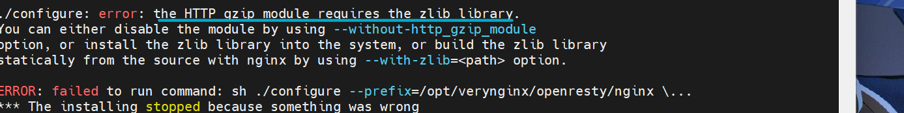

   安装`zlib`

   ```bash
   sudo apt install zlib1g-dev
   #重试
   sudo python install.py install
   ```

   安装完成后，访问`192.168.56.103`，默认是80端口。

   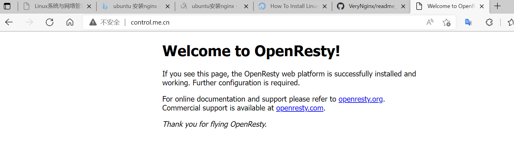

   安装成功。

4. 完成`LEMP`工作栈的配置

   - 安装`MySQL`。

     ```bash
     sudo apt install mysql-server
     sudo mysql_secure_installation #这一步在本实验中其实没有必要。在安装DVWA时造成了麻烦
     #按照接下来出现的指引完成配置。当前我的数据库密码验证政策是“中级”
     ```

   - 安装`php`

     ```bash
     sudo apt install php-fpm php-mysql
     ```

   - 配置`nginx`，让它能使用`php`

     ```bash
     #在需要使用php-fpm进行反向代理的网站的配置里将如下配置的注释解开
     
         location ~ \.php$ {
             include snippets/fastcgi-php.conf;
             fastcgi_pass unix:/var/run/php/php7.4-fpm.sock;
          }
          location ~ /\.ht {
             deny all;
         }
     ```

5. 用`wordpress`搭建站点

   1. 为它创建一个数据库，并确定好数据库的用户

      ```mysql
      create database seccuc default character set utf8 collate utf_unicode_ci;
      create user 'seccuc'@'localhost' identified by 'password'; #此处的password不是我真实的password,因为设置的安全策略的缘故，我随机生成了一串字符作为密码。
      grant all on seccuc.* to 'seccuc'@localhost;
      exit;
      ```

   2. 安装`php`插件

      ```bash
      sudo apt install php-curl php-gd php-intl php-mbstring php-soap php-xml php-xmlrpc php-zip
      sudo systemctl restart php7.4-fpm
      ```

   3. 配置`nginx`

      跟上面配置`LEMP`工作站中配置`nginx`类似。

      ```bash
      sudo vim /etc/nginx/sites-available/wp.sec.cuc.edu.cn
      #以下仅展示
      server {
          listen 8888;#避开默认端口
          server_name wp.sec.cuc.edu.cn  www.wp.sec.cuc.edu.cn;#域名
          root /var/www/wp.sec.cuc.edu.cn;#工作目录
      
          index index.html index.htm index.php;
      
          location ~ \.php$ {
              include snippets/fastcgi-php.conf;
              fastcgi_pass unix:/var/run/php/php7.4-fpm.sock;
           }
          location = /favicon.ico { log_not_found off; access_log off; }
          location = /robots.txt { log_not_found off; access_log off; allow all; }
          location ~* \.(css|gif|ico|jpeg|jpg|js|png)$ {
              expires max;
              log_not_found off;
          }
          location ~ /\.ht {
              deny all;
          }
           location / {
              #try_files $uri $uri/ =404;
              try_files $uri $uri/ /index.php$is_args$args;
          }
      
      }
      sudo nginx -t#检查语法有没有问题
      sudo systemctl reload nginx
      ```

   4. 下载`wordpress4.7`

      ```bash
      curl -LO https://github.com/WordPress/WordPress/archive/refs/tags/4.7.tar.gz #下载4.7版本的WordPress
      ```

      解压，然后将`wp-config-sample.php`复制到`wp-config.php`,然后把该目录里所有内容复制到`/var/www/wp.sec.cuc.edu.cn`下。把文件拥有者改成`www-data`

      ```bash
      sudo chown -R www-data:www-data /var/www/wp.sec.cuc.edu.cn

   5. 补完配置文件

      ```bash
      curl -s https://api.wordpress.org/secret-key/1.1/salt/
      ```

      把输出复制到配置文件中，并将database部分改成刚刚创建好的数据库及用户。

      ```bash
      define('DB_NAME', 'seccuc');
      
      /** MySQL database username */
      define('DB_USER', 'seccuc');
      
      /** MySQL database password */
      define('DB_PASSWORD', '********');
      
      ```

      

   6. 为`/etc/nginx/sites-available/wp.sec.cuc.edu.cn`在`/etc/nginx/sites-enabled/`下创建符号链接。并解除`default`的链接。重启nginx,输入IP地址查看。

      ```bash
      sudo ln -s /etc/nginx/sites-available/wp.sec.cuc.edu.cn /etc/nginx/sites-enable/
      sudo unlink /etc/nginx/sites-enabled/default
      sudo nginx -t
      sudo systemctl reload nginx
      ```

   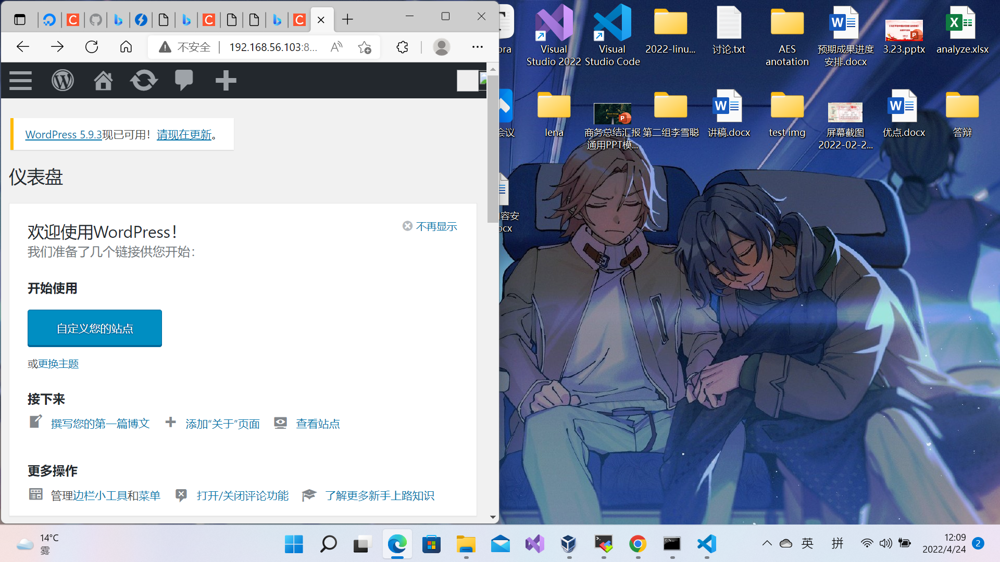

6. 用`DVWA`搭建网站。

   1. 下载`dvwa`

      ```bash
      git clone https://github.com/digininja/DVWA.git
      ```

      将里面的内容复制到`/var/www/dvwa.sec.cuc.edu.cn`中

   2. 配置`dvwa`和`php`

      将`config.inc.php.dist`复制到`config.inc.php`中。注意查看数据库配置部分，根据这部分信息创建数据库。

      修改`/etc/php/7.4/fpm/php.ini`

      ```php
      allow_url_include = On
      ```

   3. 创建数据库。大致流程和用`wordpress`搭建网站相似。但是由于我启用了较高的安全策略，默认配置的密码行不通，所以我随机生成了字符串，并用该字符串修改`config.inc.php`中的`$_DVWA[ 'db_password' ] = 'p@ssw0rd';`部分。

   4. 创建配置文件。建立软连接。

      ```bash
      server {
          listen 8081;#避开其它站点监听端口
          server_name dvwa.sec.cuc.edu.cn  www.dvwa.sec.cuc.edu.cn;
          root /var/www/dvwa.sec.cuc.edu.cn/;
      
          index index.html index.htm index.php;
      
          location ~ \.php$ {
              include snippets/fastcgi-php.conf;
              fastcgi_pass unix:/var/run/php/php7.4-fpm.sock;
           }
          location = /favicon.ico { log_not_found off; access_log off; }
          location = /robots.txt { log_not_found off; access_log off; allow all; }
          location ~* \.(css|gif|ico|jpeg|jpg|js|png)$ {
              expires max;
              log_not_found off;
          }
          location ~ /\.ht {
              deny all;
          }
           location / {
              #try_files $uri $uri/ =404;
              try_files $uri $uri/ /index.php$is_args$args;
                 }
      
      }
      
      ```

      为`/etc/nginx/sites-available/dvwa.sec.cuc.edu.cn`在`/etc/nginx/sites-enabled/`下创建符号链接

      ```bash
      sudo ln -s /etc/nginx/sites-available/wp.sec.cuc.edu.cn /etc/nginx/sites-enable/
      ```

      检查语法，重新载入，登录查看

      ```bash
      sudo nginx -t
      sudo systemctl reload nginx
      ```


#### 基本要求

- 使用*Wordpress*搭建的站点对外提供访问的地址为： `http://wp.sec.cuc.edu.cn`

- 使用*Damn Vulnerable Web Application (DVWA)*搭建的站点对外提供访问的地址为：` http://dvwa.sec.cuc.edu.cn`

基本思路是匹配到特定网址之后进行反向代理，把请求发送给本地的其它端口，使得能够仅通过域名来确定端口。

匹配规则：

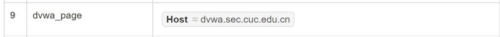

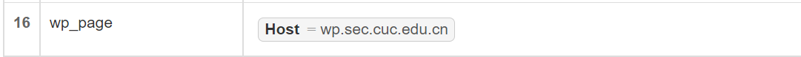

后端操作：

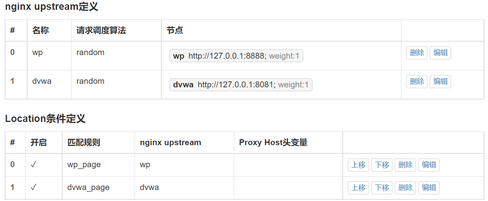

使用网址登录查看。

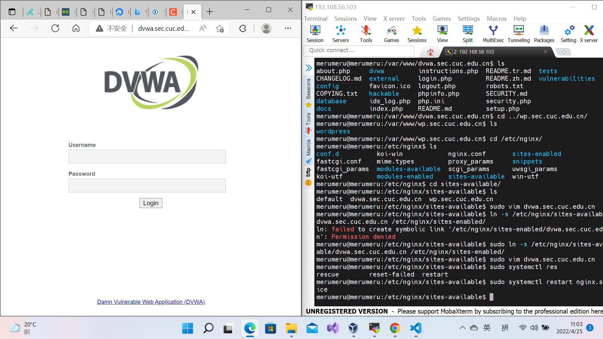

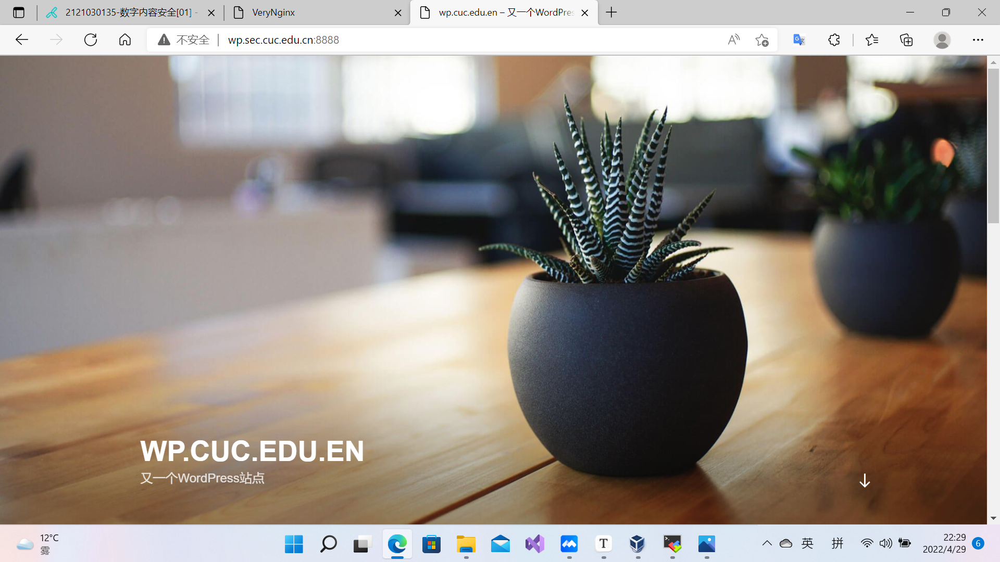

以上，基本要求完成。


#### 安全加固要求

- 使用IP地址方式均无法访问上述任意站点，并向访客展示自定义的**友好错误提示信息页面-1**

  用`control.me.cn/verynginx/index_zh.html`访问`verynginx`工作台。

  实现思路是只要**匹配规则**中有一条捕捉到了以`ip`形式访问以上站点，**拦截规则**就返回`403`并展示友好错误提示页面。

  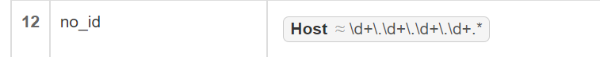

  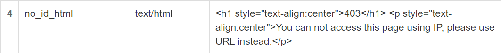

  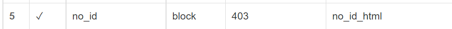

  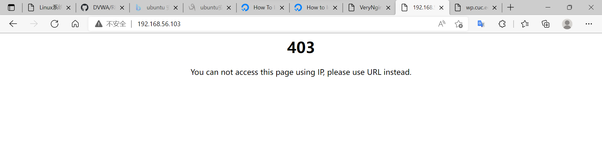

- *Damn Vulnerable Web Application (DVWA)]*只允许白名单上的访客来源IP，其他来源的IP访问均向访客展示自定义的**友好错误提示信息页面-2**

  如果不是`192.168.56.1`的ip，且访问域名是`dvwa.sec.cuc.edu.cn`,则拒绝访问，并展示友好错误提示。

  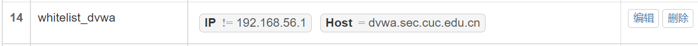

  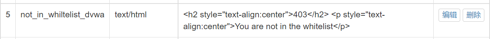

  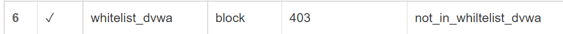

  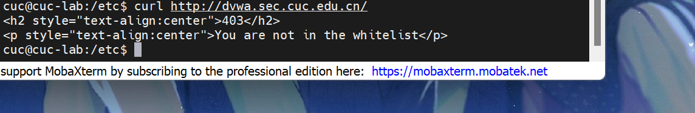

- 通过配置*VeryNginx*的Filter规则实现对*Damn Vulnerable Web Application (DVWA)*的`SQL注入实验`在`低安全等级`条件下进行防护

  在`DVWA Security`中将安全等级设定到`low`，表示当前的安全等级是低安全等级。

  进行SQLi实验，观察URL

  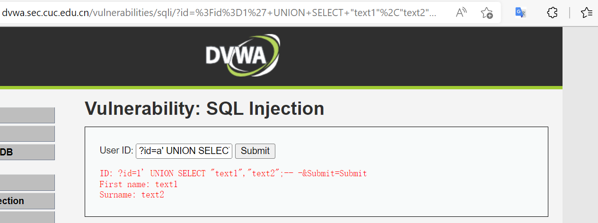

  发现参数通过参数的`id`的值进行传递。所以只要在参数里阻止`select` `union` ,就能进行防护

  

  查看效果。

  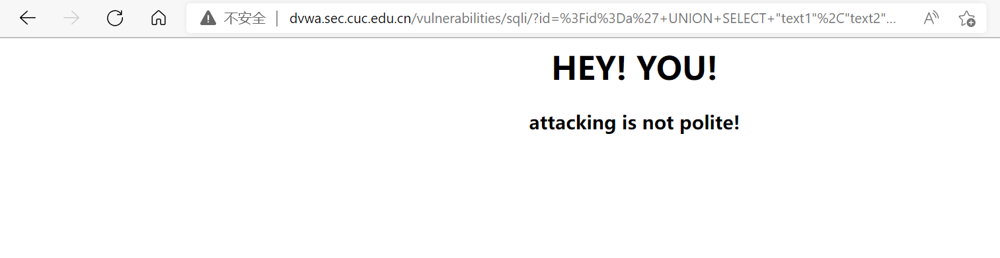

- 在不升级*Wordpress*版本的情况下，通过定制*VeryNginx*的访问控制策略规则，**热**修复`WordPress < 4.7.1 - Username Enumeration`

  ```bash
  #!usr/bin/php
  <?php
   
  #Author: Mateus a.k.a Dctor
  #fb: fb.com/hatbashbr/
  #E-mail: dctoralves@protonmail.ch
  #Site: https://mateuslino.tk 
  header ('Content-type: text/html; charset=UTF-8');
   
   
  $url= "http://localhost/";
  $payload="wp-json/wp/v2/users/";
  $urli = file_get_contents($url.$payload);
  $json = json_decode($urli, true);
  if($json){
      echo "*-----------------------------*\n";
  foreach($json as $users){
      echo "[*] ID :  |" .$users['id']     ."|\n";
      echo "[*] Name: |" .$users['name']   ."|\n";
      echo "[*] User :|" .$users['slug']   ."|\n";
      echo "\n";
  }echo "*-----------------------------*";} 
  else{echo "[*] No user";}
  
  ```

  观察代码得知，攻击首先需要访问`wp.sec.cuc.edu.cn/wp-json/wp/v2/users/`,所以只要阻止访问该链接即可。

  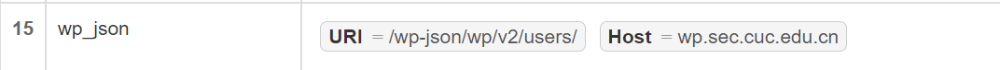

  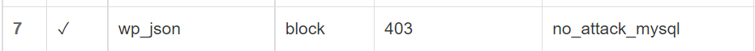

  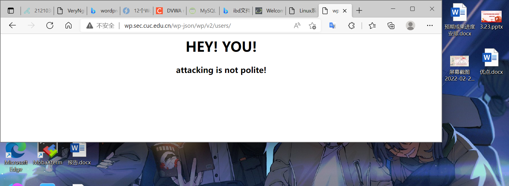


#### verynginx配置要求

- *VeryNginx*的Web管理页面仅允许白名单上的访客来源IP，其他来源的IP访问均向访客展示自定义的**友好错误提示信息页面-3**

  观察管理界面系统自带的管理页面的`filter`和`跳转行为`，`URL重写`发现，当前有三种方式能跳转到管理页面，分别是：

  - `demo_other_verynginx_uri`配合`跳转行为`

    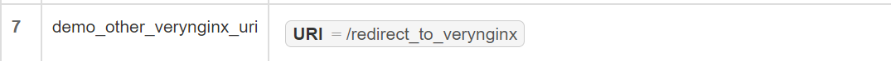

    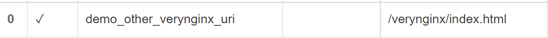

  - `demo_verynginx_short_uri`配合`URI重写`

    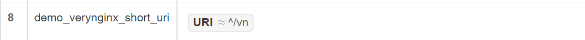

    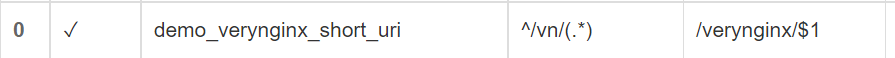

  - 直接输入`control.me.cn/verynginx/index.html`访问

  所以`filter`要把这三种情况都包括进来。

  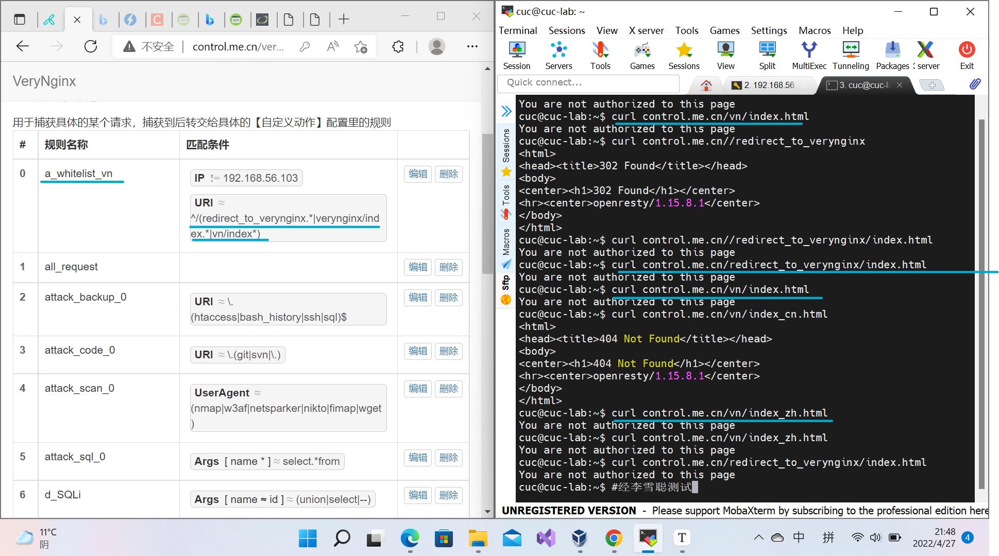

- 通过定制*VeryNginx*的访问控制策略规则实现：

  - 限制DVWA站点的单IP访问速率为每秒请求数 < 50

  - 限制Wordpress站点的单IP访问速率为每秒请求数 < 20
  - 超过访问频率限制的请求直接返回自定义**错误提示信息页面-4**

  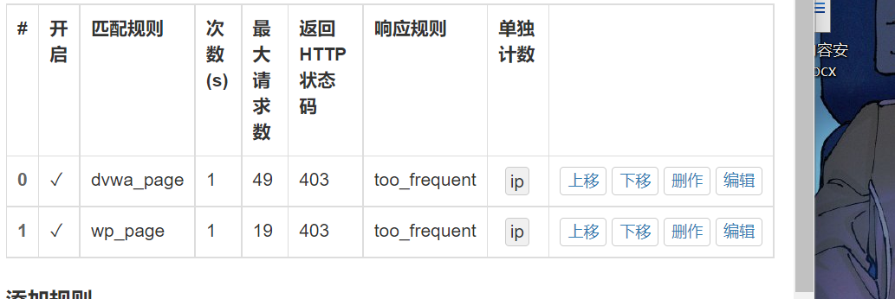

  在`响应规则`里添加`错误提示页面4`，在频率限制中引用

  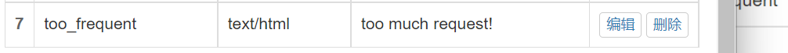

  查看效果：

  1秒钟访问次数小于50

  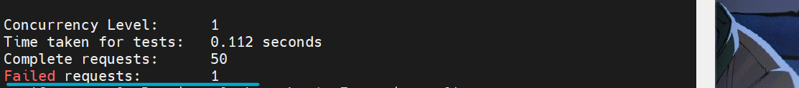

  1秒钟访问次数小于20

  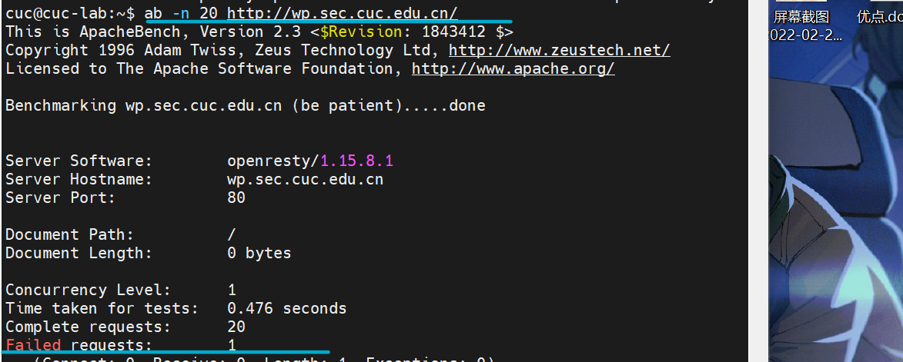

  - 禁止`curl`访问

    首先`curl`访问一下，观察它的特征。

    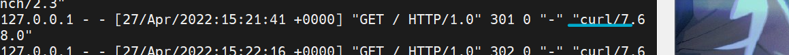

    根据`access.log`的格式，它的`UserAgent`字段里面带有`curl`的值。因此只要`UserAgent`里有`curl`就禁止访问。

    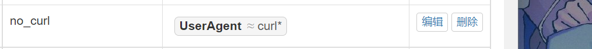

    查看效果

    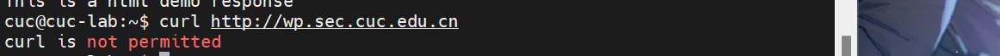


### 问题和解决方法

- 反向代理无效

  `upstream`中的节点监听`127.0.0.1`无效。只有监听`192.168.56.103`才有效。

  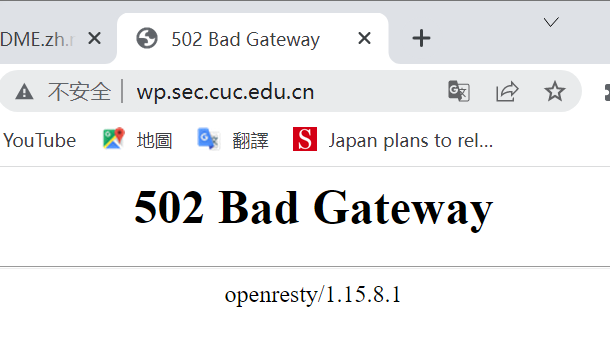

  后来发现是因为我把站点监听端口绑定到了`192.168.56.103:8888`，所以监听无效。把监听从固定ip上放开就有效了。

- `wordpress`渲染失败。

  把绑定放开，在`upstream`中将节点改到`127.0.0.1:8888`后就渲染失败了。查看`access.log`

  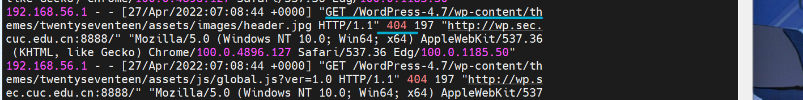

  说明按照这个路径并不能找到文件。其中`WordPress-4.7`是我最初安装`wordpress`的时候因为理解错误在`/var/www/wp.sec.cuc.edu.cn`底下放置的包含所有`wordpress`文件的文件夹。后来我意识到这样需要把工作目录一并修改，就把它的内容全部放到`/var/www/wp.sec.cuc.edu.cn`底下，并删除了该文件夹。这是在与`192.168.56.103`解绑之前的事情。

  寻找了各个可能的文件夹以修改访问路径，除了`mysql`的`ibd`文件外找不到任何`WordPress-4.7`这样的字眼。于是我打算修改`/var/www/wp.sec.cuc.edu.cn`目录结构。把`wordpress`中内容复制到`/var/www/wp.sec.cuc.edu.cn`目录下，再次访问即可成功。

- `zlib`安装问题。

  

  缺少`zlib library`，但是`apt policy zlib1g`发现本机其实安装了.

  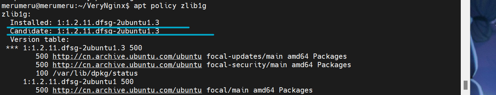

  那为什么显示需要`zlib library`呢？参考`trouble shooting`，每一个可能缺少的包其实都包含它本身和一个`dev`包。所以查询一下`zlib1g-dev`，果然没有。

  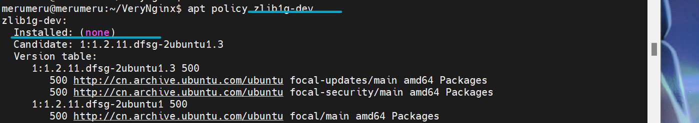

  `sudo apt install zlib1g-dev`即可。

- `verynginx`配置写入问题。

  最初`verynginx`配置无法保存，根据老师的视频了解到是因为它没有写入权限。在本机查看后发现，事实上是因为`config.json`文件根本就不存在，需要手动添加。添加后还需要更改文件属主。

  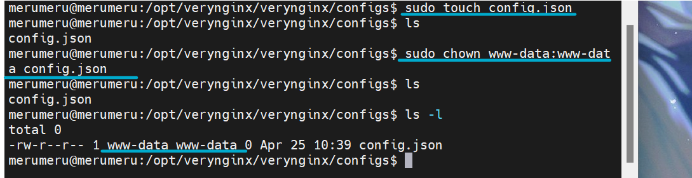

- `dvwa`权限问题

  完成安装之前，发现如下标红问题。

  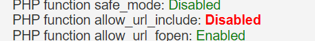

  根据提示，需要修改`php.ini`文件。

  

  另外，页面还提示`recaptcha key`缺失。根据提示，找到Google的一个生成它的网站，本想着生成一个，但是注意到它的服务条款：

  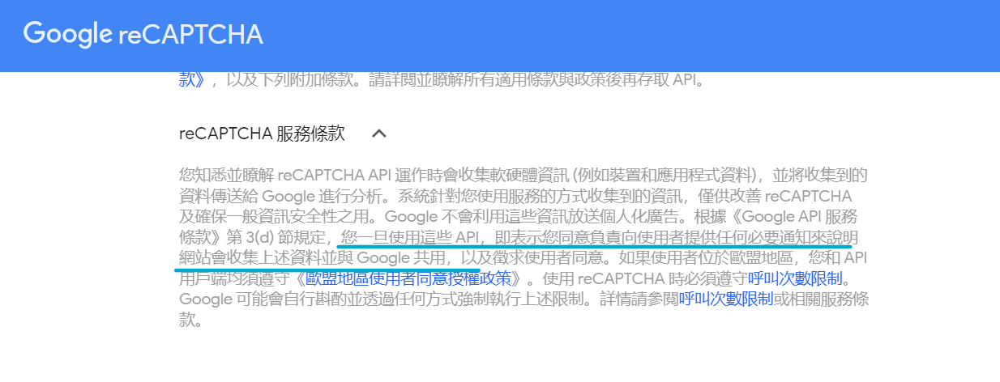

  我认为作为一个作业来说，没有必要向google透露过多信息（虽然可能已经透露不少了），所以决定先放弃`recapcha key`的获取，直接安装。


### 参考资料

- [Nginx+Php-fpm运行原理 代理与反向代理](https://zhuanlan.zhihu.com/p/107808165)
- [8分钟带你深入浅出搞懂Nginx - 知乎 (zhihu.com)](https://zhuanlan.zhihu.com/p/34943332)
- [虚拟主机-Nginx中文文档](https://www.nginx.cn/doc/example/virtualhost.html)
- [nginx php-fpm安装配置 | Nginx 中文官方文档 (gitbooks.io)](https://wizardforcel.gitbooks.io/nginx-doc/content/Text/6.5_nginx_php_fpm.html)
- [Nginx 配置文件nginx.conf中文详解_w3cschool](https://www.w3cschool.cn/nginx/nginx-d1aw28wa.html)
- [How To Install Linux, Nginx, MySQL, PHP (LEMP stack) on Ubuntu 20.04 | DigitalOcean](https://www.digitalocean.com/community/tutorials/how-to-install-linux-nginx-mysql-php-lemp-stack-on-ubuntu-20-04)
- [How to Install WordPress with LEMP on Ubuntu 20.04 | DigitalOcean](https://www.digitalocean.com/community/tutorials/how-to-install-wordpress-with-lemp-on-ubuntu-20-04)
- [VeryNginx/readme_zh.md at master · alexazhou/VeryNginx · GitHub](https://github.com/alexazhou/VeryNginx/blob/master/readme_zh.md)
- [请问如何对泛域名做反向代理？ · Issue #167 · alexazhou/VeryNginx · GitHub](https://github.com/alexazhou/VeryNginx/issues/167)
- [proxy_pass url 反向代理的坑 | Nginx 入门教程 (xuexb.github.io)](https://xuexb.github.io/learn-nginx/example/proxy_pass.html#url-包含路径)
- [Nginx访问日志（access_log）配置及信息详解_strggle_bin的博客-CSDN博客_access.log](https://blog.csdn.net/strggle_bin/article/details/110561976)
- [许师哥的实验报告](https://github.com/CUCCS/2021-linux-public-kal1x/blob/chap0x05/chap0x05/第五次实验.md)
- [SQL Injection Cheat Sheet](https://www.invicti.com/blog/web-security/sql-injection-cheat-sheet/)

